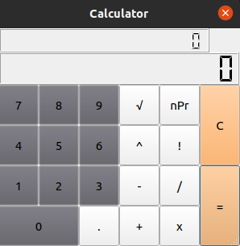

# IVS Team Project

A calculator with basic operations and GUI. 

 

## Enviroment

Ubuntu 64bit

## Authors

NotLikeThis

**Vojtěch Eichler** - xeichl01

**Václav Korvas** - xkorva03

**Tomáš Matuš** - xmatus37 

**Adam Zvara** - xzvara01

## License

This program is licensed under the GNU General Public License v3.0.

## Results

48/52 per person.

Some points that stood up during our evaluation:
- Chybný název plánu.
- Chybí akutní komunikační prostředek. Co když si vedoucí v den odevzdáním utopí počítač?
- Bonus za použití Trello.
- Makefile:
  - nebyly využity automatické proměnné https://www.gnu.org/software/make/manual/html_node/Automatic-Variables.html
  - Instalace závislostí: Schází instrukce pro nainstalování závislostí (např. "requirements.txt")
  - make all: Spustí program, což není žádané. Pro tento účel existuje cíl "run". Pro jazyk Python předpokládám, že cíl “all” může provést instalaci závislostí.
  - make profile: Spustí program pro výpočet směrodatné odchylky, což není žádané. Na to mohl být vytvořen jiný cíl, např. “profile_run”.
  - make pack: Skončí chybou: “cp: nelze získat informace o '../../ivs-project2/.': Adresář nebo soubor neexistuje”
- Chyby: program umí druhou odmocninu ze záporných čísel
- Uživ. přívětivost: chybí tlačítko CE
- Uživ. přívětivost: nelze zadat záporná čísla
- Uživatelská příručka: Chybí popis ovládání
- Matematická knihovna: Nezdokumentované zaokrouhlování čísel.
- Generovaná dokumentace: chybí některé komentáře
